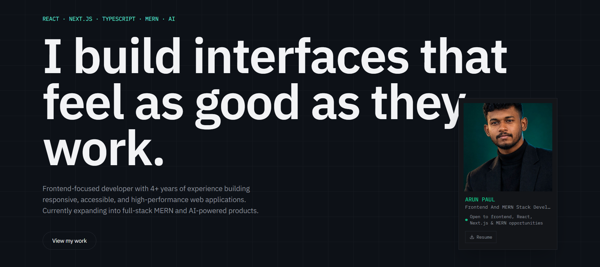
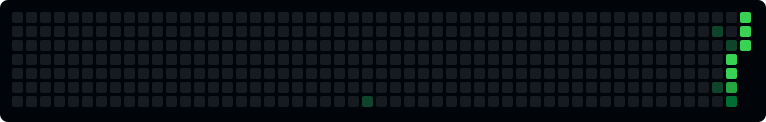
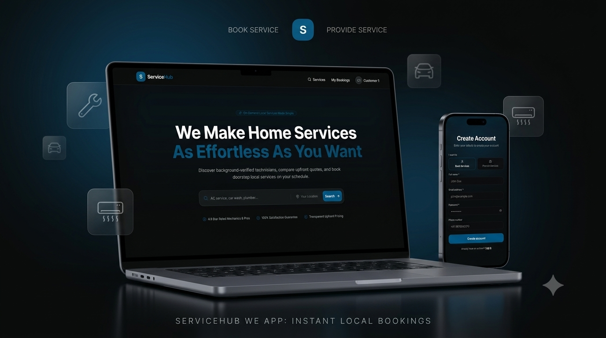

<div align="start">
  


# ARUN PAUL

### Frontend & Full-Stack Developer

`React` · `Next.js` · `TypeScript` · `MERN`

> I build interfaces people enjoy using  
> and systems that power them.

**4+ years frontend experience**  
<br />
`Currently building full-stack products`



<sub>GITHUB ACTIVITY · BUILDING CONSISTENTLY</sub>

[Portfolio ↗](https://portfolio-new-five-rust.vercel.app/)
&nbsp;&nbsp;·&nbsp;&nbsp;
[LinkedIn ↗](https://www.linkedin.com/in/arun-paul-dd/)
&nbsp;&nbsp;·&nbsp;&nbsp;
[Email ↗](mailto:arunpaulpvt@gmail.com)

<br />
`Frontend Engineering` · `Full-Stack Development` · `Product UI`
<br />

</div>

---

## `01` — WHAT I BUILD

I enjoy turning ideas, designs and complex requirements into **clean, responsive and production-ready products**.

My strongest area is frontend engineering, while I'm actively expanding deeper into **Node.js, Express and MongoDB** through full-stack projects.

### Frontend

`React` `Next.js` `TypeScript` `JavaScript` `Vue`  
`Redux Toolkit` `Tailwind CSS` `Ant Design` `MUI`  
`React Hook Form` `GSAP` `Framer Motion`

### Backend & Full Stack

`Node.js` `Express` `MongoDB` `REST APIs` `JWT`  
`Prisma` `MySQL` `Firebase`

### Engineering

`API Integration` `Performance` `Accessibility`  
`Core Web Vitals` `Reusable Components` `Git` `Figma` `Cursor`

---

## `02` — EXPERIENCE

### 4+ Years Building Production Frontends

I've worked across **e-commerce, analytics and data-driven applications**, building interfaces that combine usability, performance and maintainable architecture.

**Things I've worked on:**

* E-commerce storefronts and UI systems
* Data-heavy analytics dashboards
* REST API integrations
* Advanced search and filtering
* Responsive design systems
* Performance optimization
* WCAG / accessibility improvements
* Interactive UI and micro-interactions
* Reusable React component architecture

---

## `03` — CURRENTLY BUILDING

<a href="https://service-marketplace-blush.vercel.app/">
  
</a>

### 🛠️ Service Marketplace

A full-stack marketplace where customers can **discover, book and review local service providers**.

Built from the ground up with a focus on real-world backend architecture and business logic.

`React` `Node.js` `Express` `MongoDB` `JWT`

**Implemented**

`Authentication` · `Services` · `Search & Filtering` · `Pagination`  
`Provider Availability` · `Bookings` · `Cancellation` · `Reviews`

**Currently working on:** frontend architecture, provider workflows and production deployment.

**[↗ Live Project](https://service-marketplace-blush.vercel.app/)** · **[⌘ Source Code](https://github.com/2000polo/service-marketplace)**

---

## `04` — SELECTED PROJECTS

<table>
<tr>
<td width="50%" valign="top">

<a href="https://note-app-mk51.onrender.com/">

</a>

### NoteApp

A full-stack note management application with authentication, protected resources and user-specific CRUD operations.

`React` `Node.js` `Express` `MongoDB` `JWT`

**[Live ↗](https://note-app-mk51.onrender.com)** · **[Code ↗](https://github.com/2000polo/note-app#-notesapp--modern-full-stack-note-management)**

</td>
</tr>
</table>

---

## `05` — HOW I LIKE TO BUILD

```text
01  Understand the problem
02  Design the experience
03  Build reusable components
04  Connect the APIs
05  Optimize performance
06  Ship → learn → improve
````

I care about the details that make a product feel finished:

**UI quality · performance · accessibility · maintainability**

---

## `06` — CURRENTLY EXPLORING

```text
→ Full-Stack Architecture
→ Advanced Node.js / Express
→ MongoDB & API Design
→ Next.js
→ AI-assisted Development
→ GenAI Engineering
```

---

## `07` — LET'S BUILD

<div align="center">

**Open to Frontend, React, Next.js and MERN opportunities.**

If you're building something interesting, let's talk.

<br />

[🌐 Portfolio](https://portfolio-new-five-rust.vercel.app/) ·
[💼 LinkedIn](https://www.linkedin.com/in/arun-paul-dd/) ·
[🐙 GitHub](https://github.com/2000polo)

<br /><br />

`Build useful things. Make them fast. Keep learning.`

</div>

The next improvement I'd make is the **Service Marketplace thumbnail** — something visually strong that looks good inside this README rather than a generic screenshot.
